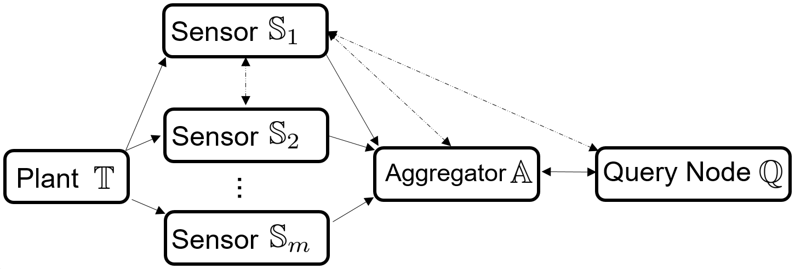
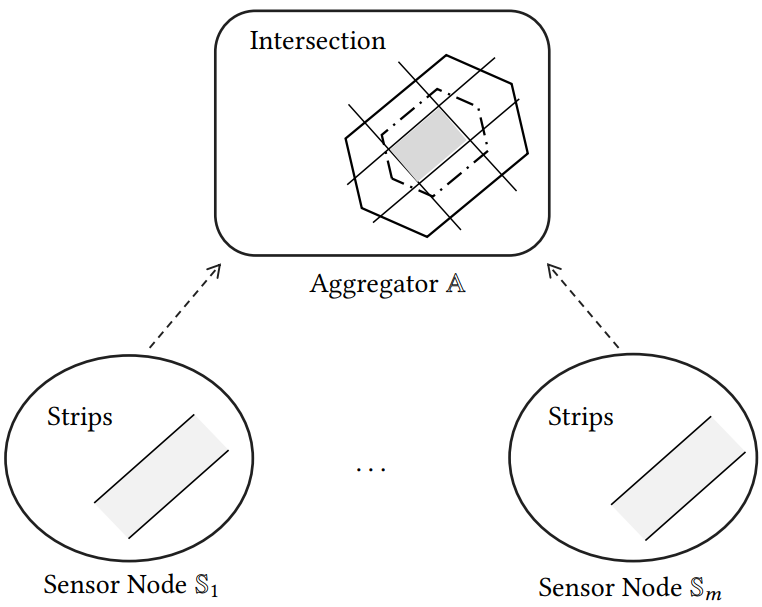
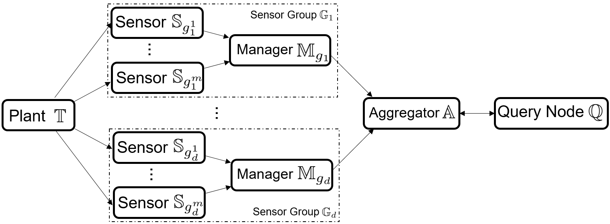
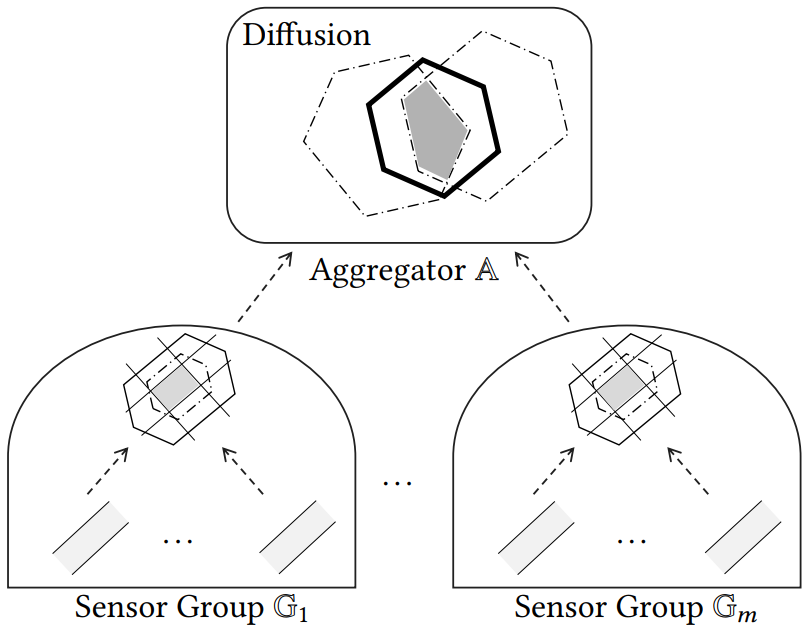

# Privacy Preserving Set-Based Estimation Using Partially Homomorphic Encryption

This repo cotains the code and data for our paper "[Privacy Preserving Set-Based Estimation Using Partially Homomorphic Encryption](http://arxiv.org/abs/2010.11097)"<br /><br />

We propose privacy-preserving set-based estimation protocols using partially homomorphic encryption. Set-based estimation constructs a set that guarantees the inclusion of the system state. We represent sets by zonotopes and constrained zonotopes as they can compactly represent high-dimensional sets and are closed under linear maps and Minkowski addition. By selectively encrypting some parameters of the used set representations, we are able to intersect sets in the encrypted domain, which enables guaranteed state estimation while ensuring the privacy goals. In particular, we show that our protocols achieve computational privacy using formal cryptographic definitions of computational indistinguishability. We demonstrate the efficiency of our approach by localizing a mobile quadcopter using custom ultra-wideband wireless devices.

We consider two problem setups:

1- Distributed sensor
The setup is as follows:
<br /> <br />
<p align="center">

</p>

Aggregator collects encrypted strips from each sensor and intersects them with the previous estimated set to obtain a new corrected set.  

<br /> <br />
<p align="center">

</p>

2- Distributed sensor groups

<br /> <br />
<p align="center">

</p>
Each sensor group manager collects a set of strips from its sensors and intersects them with previous sets. Then share with the aggregator an encrypted set. The aggregator collects encrypted sets from each sensor group and intersects them with the previous estimated set to obtain a new corrected set.  

<br /> <br />
<p align="center">

</p>
Please refer to the paper for more technical details. Our Bitex is as follows <br />

```
@misc{alanwar2020privacy,
      title={Privacy Preserving Set-Based Estimation Using Partially Homomorphic Encryption}, 
      author={Amr Alanwar and Victor Gassmann and Xingkang He and Hazem Said and Henrik Sandberg and Karl Henrik Johansson and Matthias Althoff},
      year={2020},
      eprint={2010.11097},
      archivePrefix={arXiv},
      primaryClass={cs.CR}
}
```
<br />
## Building


1- install Visual Studio Code  <br />
2- add extention c/c++  <br />
3- clone this repo <br />
4- open Visual Studio Code <br />
5- file--> open folder (open the repo folder) <br />
6- Make sure that your matlab path are correct in the makefile CXXFLAGS line <br />
7- view --> terminal  <br />
8- sudo apt install libeigen3-dev <br />
9- sudo apt-get install libboost-dev <br />
10- sudo apt-get install libntl-dev <br />
11- sudo apt-get install libgmp-dev <br />
12- make all <br /> <br />
(for debugging)<br />
make debug<br /> 

## Running

File ZonoStrips.cpp for protocol 1 with zonotopes.<br />
File ZonoEntities.cpp for protocol 2 with zonotopes.<br />
File ConZonoStrips.cpp for protocol 1 with constrained zonotopes.<br />
File ConZonoEntities.cpp for protocol 2 with constrained zonotopes.<br />
copy the required file to main cpp then make all<br />

1- This will run main.cpp <br />
 ./HW <br />
2- This will generate file under "MATLAB/CMatFiles/FILENAME"<br />
3- run the correspoding file in matlab<br />
4- This will generate file under "cache/FILENAME"<br />
5- run <br />
A-plot_ZS_cppAndMat<br />
B-plot_ZE_cppAndMat<br />


